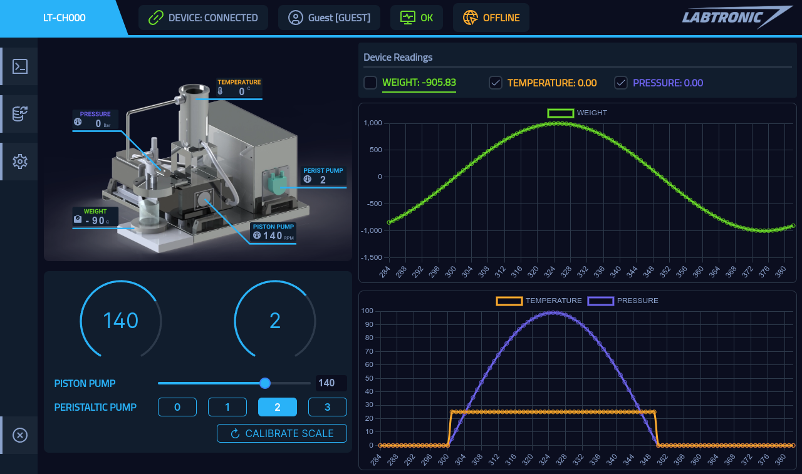

# LabTronic Control Hub V2

## Description
LabTronic Devices Software MonoRepo

## Tech Stack
The software was built using hybrid technology stack.  
This stack allows the software to run on Desktop (Windows, MacOS, GNU/Linux) or the Web.  
The UI was built using Vue3 framework and PrimeVue components library.  
ElectronJS was used to access device native functionality.  

## Features
1. GUI Device Control
2. Display Device Readings
3. Connected to LabTronic Cloud CDN
4. Device Readings Database **TODO**
5. Cloud Device Control **TODO**
6. Export Data, Graphs, Insights **TODO**

## Screenshots

    

