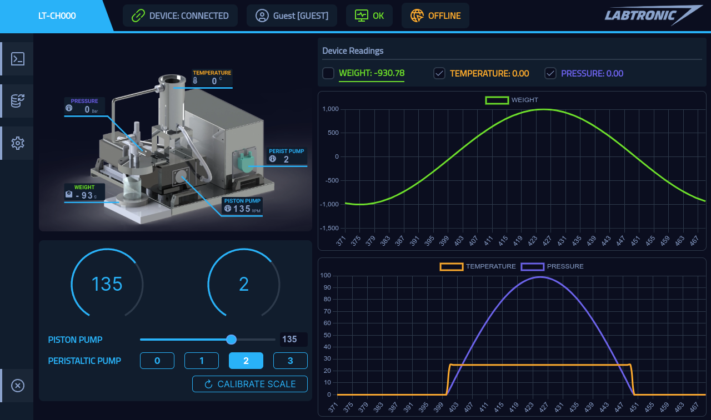
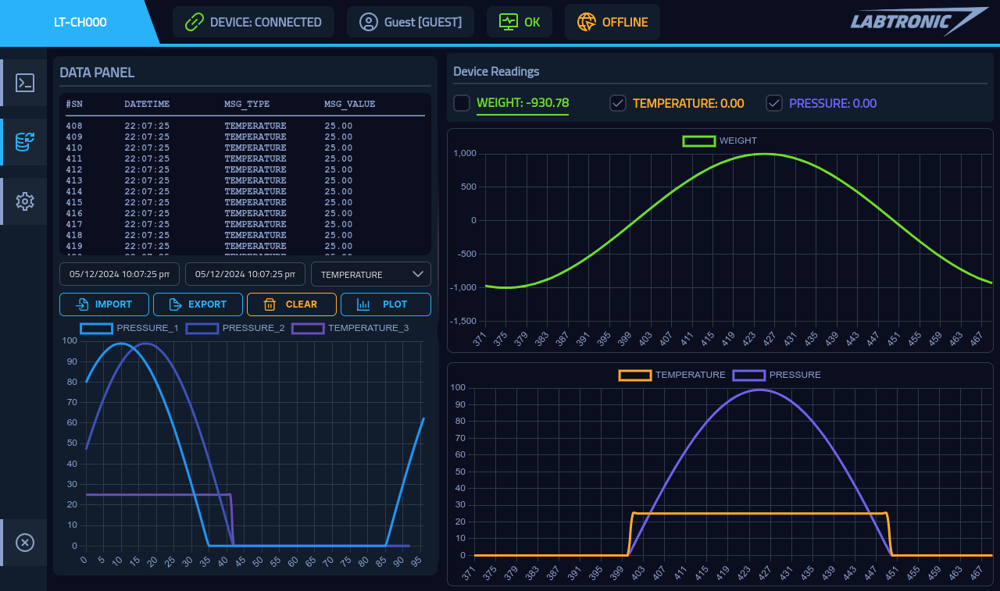
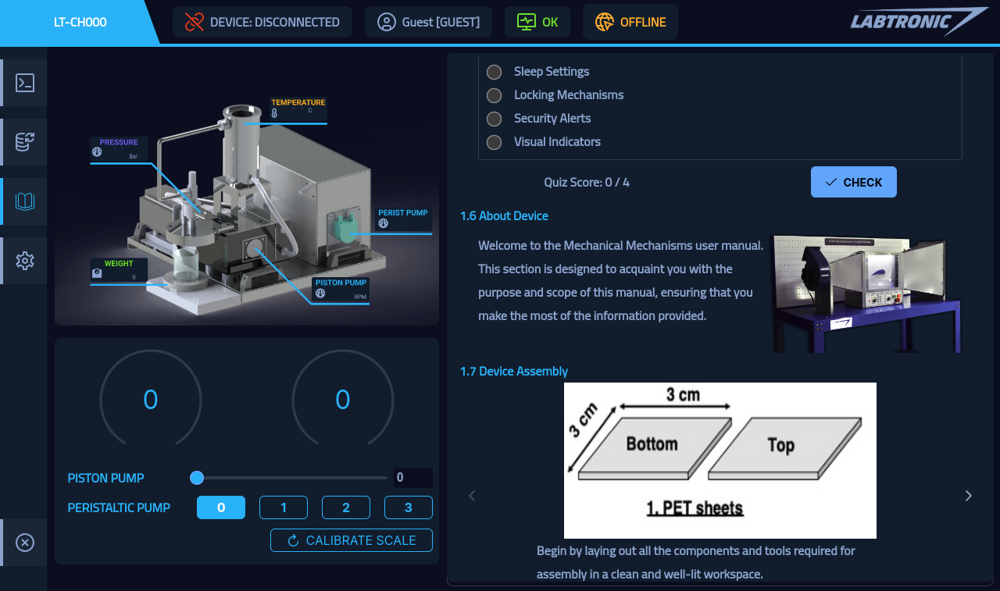
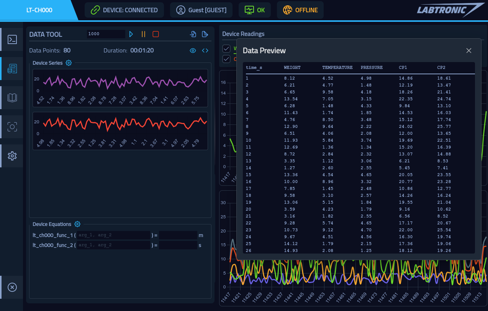

# LabTronic Control Hub V2

## Description
LabTronic Devices Software MonoRepo

## Tech Stack
The software was built using hybrid technology stack.  
This stack allows the software to run on Desktop (Windows, MacOS, GNU/Linux) or the Web.  
The UI was built using Vue3 framework and PrimeVue components library.  
ElectronJS was used to access device native functionality.  
<a href="https://nodejs.org" target="_blank" rel="noreferrer">
    
</a>
<a href="https://www.electronjs.org" target="_blank" rel="noreferrer">
    
</a>
<a href="https://vuejs.org/" target="_blank" rel="noreferrer">
    
</a>

## Features
- [x] GUI Device Control
- [x] Display Device Readings
- [x] Connected to LabTronic Cloud CDN
- [x] Device Readings Database
- [ ] Cloud Device Control
- [x] Export Data, Graphs, Insights
- [x] Easy Lab Report Generation

## Run on Windows
1. Install NodeJS from this [Link](https://nodejs.org/en)
2. Install Git from this [Link](https://git-scm.com/download/win)
3. Install Python from this [Link](https://www.python.org/downloads/)
4. Clone the Repo
```bash
git clone https://github.com/aAbstract/labtronic-control-hub-v2.git
```
5. Install Dependencies
```bash
npm install
```
6. Run the Software
```bash
npm run dev
```
7. Run CHX Module
```bash
python scripts/run_chx_module.py <chx_module_name>

# chx_module_name
# Cross Flow Membrane Filtration: lt_ch000

# Heat Conduction in Metals: lt_ht103
# Linear and Radial Heat Conduction: lt_ht107
# Unsteady Heat Transfer Apparatus: lt_ht113
# Free and Forced Convection: lt_ht004

# Change of State of Gases: lt_to101
# Temperature Measurement Trainer: lt_to202

# Wind Energy Training System: lt_re600
```

## Main Screen
<p align="center">
    
</p>

## Data Panel
<p align="center">
    
</p>

## Device Manual Panel
<p align="center">
    
</p>

## Data Tool
<p align="center">
    
</p>